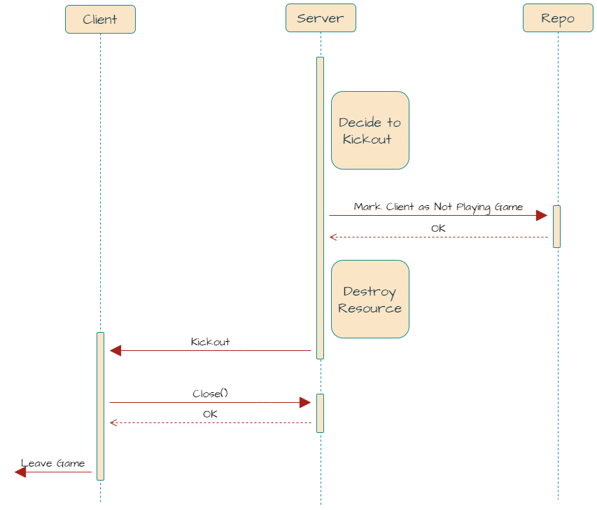

# card-game-server-prototype

## **Overview**

A game server framework that can scale with [Agones](https://agones.dev/site/).
All logic run on single goroutine, thus it's easier to reason about the game flow.
The architecture primarily aim for the development of turn based game.

## **Prerequisite**

- Install [Go](https://go.dev/doc/install) version >= 1.20
- Install dependency injection framework [Wire](https://github.com/google/wire)
- Run `go mod download` in the project root directory to download required go module.

## **Getting Started**

Get familiar with the following libraries:

- [Wire](https://github.com/google/wire) (Compile-time Dependency Injection)
- [Stateless](https://github.com/qmuntal/stateless) (Finite State Machine)
- [Grpc](https://grpc.io/docs/languages/go/basics/) (Network protocol)
- [zap](https://github.com/uber-go/zap) (Logger)
- [lo](https://github.com/samber/lo) (Lodash-style library for data manipulation)

Run server by:

```
wire ./pkg
go run ./pkg
```

Observe the logs and the flags description for more detail.

The behavior of some config depends on how the game logic is implemented.
You will have to look into the game logic to understand the behavior of the config.
See `pkg/config` for all available configs.

Here is some typical usage:

```
// Run server with no auth on client and in local mode (no remote api or agones will be called)
go run ./pkg --no-auth --local-mode --game-type="9" --game-mode="1" 

// Run server with single mode: allow game to be played with 1 player by populating ai player
go run ./pkg --single-mode --game-type="4" --game-mode="1"

// Set log level seperately for each game type. Debug log for game type 4 and info log for game type 5
go run ./pkg --debug-games=4 --info-games=5
```

## **Control Flow Components**

These are the building blocks for all game logic. Knowing the role of
each component is essential for building game logic. Mostly, you will be implementing the behavior of the game in the
following components. These components provide hooks for you to insert the logic and thus control the game flow. When
client sends a message to server, the message will be dispatched to the hook too.

### **Game**

Game is main entry point for game logic and manages the main runner
loop. When game start, game will register game state and grpc server.
During the game, it's controls the transitioning between game states
and dispatch message from client to game state logic. See
`pkg/core/game.go` for more detail.

It also provides the following interfaces for developer to register
their game logic to handle dispatched message from client:

- OnConnect()
- OnEnter()
- OnLeave()
- OnDisconnect()
- OnRequest()

### **State**

State is a base template for game state. Each game state should embed
it. It has some default method implementation for state transition and
message dispatching. Developer can override these methods to customize
the behaviors. See `pkg/core/state.go` for more detail.

When game state transition happens, game will exit the source state
and enter the destination state. The order of method call is as
follows:

1. source state CleanUp()
2. destination state Run()
3. destination state beforePublish()
4. destination state Publish()

During game, any message from client will be dispatched to current
game state. By the means of the following methods:

- BeforeConnect()
- HandleConnect()
- BeforeEnter()
- HandleEnter()
- BeforeDisconnect()
- HandleDisconnect()
- BeforeLeave()
- HandleLeave()
- BeforeRequest()
- HandleRequest()
- AcceptRequestTypes()

## **Data Manipulation Components**

These components are used to store and manipulate data during game.
The storage and behavior of data are separated into two components: **model** and **service**.
Do not mix them together. The reason for separation is that **model** stores data that needs to be sent to client and
thus
the structure will be more in favor of frontend need. On the other hand, game server will not necessarily want to
have the same structure as frontend for manipulating data. Thus, **service** is created to manipulate data in a way that
is more suitable for game
server. Also, this separation will allow service provides a better way to customize the behavior of data manipulation
under different game modes while providing same data structure to frontend.

### **Model**

- For every data that needs to be stored and send to frontend, it should be a
  model.
- The structure of model should be in favor of frontend need.
- It typically does not contain any logic. It only stores data.
- Model is modified during `State.Run()` of a game state and published at
  the `State.Publish()` of the same game state.
- See `pkg/common/model/user_group.go` for example.

### **Service**

- Encapsulate a part of game logic that manipulates data in model. Typically, will manipulate multiple models.
- Duplicate logic in different game state should be extracted to
  service.
- Service should be stateless. It should not store any data. It should
  only provide logic to manipulate data.
- Service provide the chance to implement different behavior for different mode.
- See `pkg/common/service/user_service.go` for example.

## **Message Components**

These components are used to send message between game server and client.


### **MsgBus**

- This is the way for game server to send message to client.
- Can choose either `Broadcast` or `Unicast`.
- During game, game state logic will publish message to server
  component for it to send to client. This mostly happens in `State.Publish()` of each game state.
- All server component subscribe to message bus to receive message.

### **Server**

- Implementation of GRPC server.
- Receives client's request and send message to core game component for it to dispatch message.
- In some case, server will mask the message before sending it to client. This is useful if you want to hide card
  information specifically for a client.
- Listen message from MsgBus and send message back to client.

### **API**

- Implementation of HTTP API to remote server.
- Can mock local API and run game sever with `local-mode` flag. Useful for development and testing.

## **Other Components**

### **Actor**

Actor encapsulates the automatic behavior of a player. It will send Request on behalf of player (
trigger `Game.OnRequest()`, `State.HandleReqeust()`).
For example, auto action after timeout and ai player action can be implemented in Actor.
See `pkg/core/game.go RunActorRequests()` and `pkg/core/actor.go` for more detail.

## **Connection Flow**

This section describes how client should connect to game server.

### **RPCs**

These rpc requests construct the connection flow to game server.

**1. Connect()** : establish session on game server

Before calling any rpc request, client must first call this rpc to establish session on game server. Server will
validate and authenticate client before it creates session. If client does not have session on game server, all rpc
request from this client will be rejected with Unauthenticated status .

**2. Ping()**: checks connectivity and maintain the created session.

After session is created (`Connect()` returned `OK`), client will have to send heartbeat `Ping()` to server
periodically. If server doesn’t receive ping from client for a while, it will assume client is dead and destroy the
session. Client will have to `Connect()` again to rebuild the session. How frequent client should ping depends on server
configuration.

On the other hand, if the client does not receive OK from `Ping()`, it can know something is wrong. Either server is
unreachable or the session is destroyed already. In all cases, it means client has lost connection to server and the
client should `Connect()` again to rebuild the session.

**3. Enter()**: notifies game server that client is ready to play game.

After session is created (`Connect()` returned `OK`), client can confirm it's accepted by game server and has the right
to enter game. It should start loading game resource (e.g. loading unity scene) and preapre for receiving data from game
server (e.g. subscribe to message stream). Once client finishes initializing resource, it should call `Enter()` so game
server can acknowledge client is ready. After that, game server will start the game and send data to client for
rendering.

**4. Leave()**: notifies game server that client wants to leave game.

Client cannot leave game at its will. It must notify game server first and let game server respond whether client can
leave. For example, game server can reject `Leave()` when the game is still running. In this case, client will receive
status code. On the other hand, if game server approve leaving, it will destroy any resource related to the client and
respond OK to client. Shortly, game server send Kickout to client. Only at this moment, client can peform leave game
operation.

**5. Kickout & Close( )**: Kickout notify client that it should leave game and client send `Close()` to acknowledge
kickout.

Client cannot leave game at its will. It can only and must leave game, when it receives Kickout message from game
server. Before leaving game, client should call `Close()` to notify game server that it’s going to leave.

### **Connection Flow**

**1. Connect to Game Server**


**2. Disconnect From Game Server (Manually Leave)**


**3. Disconnect From Game Server (Kickout by Server)**



### **Connectivity**

**1. Server Use Ping() to Detect Connectivity**

If Server doesn’t receive Ping() for a while, the client will be viewed as disconnected and the session will be deleted.


**2. Client Use Ping() to Detect Connectivity**

Client can detect connection has loss to server by using Ping() and should try reconnect to server.


## **Single Thread Logic & Async Operation**

All logic inside `Game` and `State` hook run on single main goroutine loop.
That means you don't have to worry about race condition inside function such
as `Game.OnRequest()`, `State.Run()`, `State.HandleRequest()` etc.
This enables us to write our model and service without adding a lot of synchronization primitives (locks, channels).
For more detail, see `pkg/core/game.go baseGame.Run()`.

However, one has to be careful that these logic is synchronous and blocking. If you run a long operation inside these
hooks, the game will be blocked and no other operation can be processed.

To avoid this, you can use another goroutine to run the long operation and evaluate the result. If you have to update
the `Model` in the end, you must use `Game.RunTask()` or `Game.RunTimer()`. These methods will ensure the update is done
in the main goroutine loop. For example:
```go
func (s *State) Run() {
    go func() {
        // long operation
        result := longOperation()
        s.Game.RunTask(func() {
            // update model
            s.Model.data = result
        })
    }()
}

```

## **Model Lifecycle**

The lifecycle of data in game server is important.It determines how data is created, and deleted.Since game
server has the complexity of modifying data, it's recommended to follow the lifecycle to avoid data
corruption.Also, you must always know what data is available at each lifecycle to avoid accessing data that is not
there.There are typically 3 kinds of lifecycle you will encounter in game server:

### **User Connection Lifecycle**

- create: when client `Connect()` to server.when `User` is created in `UserService.Init()`.
- init: when client `Enter()` to server.when `User` is initialized in `UserService.FetchFromRepo()`.
- delete: when client `Leave()` or disconnected from server.when `User` is destroyed in `UserService.Destroy()`.

### **Game Lifecycle**

- create: when game is about to start, usually in `StartRoundState`, `StartGameState`.
- delete or reset: when game is finished, usually in `RoundResetState`, `ResetState`.

### **User Connection Cache Lifecycle**

- create/update: when client `Connect()` to server.when `User` is created in `UserService.Init()`. If user already
  exists, it will be updated.
- init: when client `Enter()` to server. when `User` is initialized in `UserService.FetchFromRepo()`.
- delete: when timer is expired.

## **Development Related Practices**

### **Local Testing**

For local testing, implement local mode API and wire build a local game.
You can then use `--local-mode` flag to run game server.it will skip all remote api and agones call.

### **Note for Model `RoomInfo.ValidUsers`**

*Buddy mode*

Empty.No need to validate user.

*Any mode created by match server, ex.Common mode, Club mode, Rank mode, Qualifier mode*

Provided by allocate server.Use it to valid user is allowed to enter game.

*Elimination mode*

Provided by main server.Use it to valid user is allowed to enter game.

### **Cheat Data**

You can use cheat data to test game logic.Cheat data is a way to inject data to game server to test game logic.
For example

* examples: `{path_to_game}/type/cheat/*.sh`

#### mj cheat tiles

| Suit    | Code |
|---------|------|
| 萬       | 100  |
| 筒       | 200  |
| 索       | 300  |
| 風/中/發/白 | 400  |
| 花       | 500  |

| Face | Code |
|------|------|
| 1    | 1    |
| 2    | 2    |
| 3    | 3    |
| 4    | 4    |
| 5    | 5    |
| 6    | 6    |
| 7    | 7    |
| 8    | 8    |
| 9    | 9    |

| Face | Code |
|------|------|
| 東    | 11   |
| 南    | 12   |
| 西    | 13   |
| 北    | 14   |
| 中    | 15   |
| 發    | 16   |
| 白    | 17   |

| Face | Code |
|------|------|
| 梅    | 31   |
| 蘭    | 32   |
| 竹    | 33   |
| 菊    | 34   |
| 春    | 35   |
| 夏    | 36   |
| 秋    | 37   |
| 冬    | 38   |

```yaml
                - --cheat-mode-game=4
                - >
                  --cheat-data='{
                    "wallHeadTiles": [
                      {"suit": 100, "face": 1},
                      {"suit": 100, "face": 1},
                      {"suit": 100, "face": 1},
                      {"suit": 100, "face": 2},
                      {"suit": 100, "face": 2},
                      {"suit": 100, "face": 2},
                      {"suit": 100, "face": 3},
                      {"suit": 100, "face": 3},
                      {"suit": 100, "face": 3},
                      {"suit": 100, "face": 4},
                      {"suit": 100, "face": 4},
                      {"suit": 100, "face": 4},
                      {"suit": 100, "face": 5},

                      {"suit": 400, "face": 11},
                      {"suit": 400, "face": 11},
                      {"suit": 400, "face": 11},
                      {"suit": 400, "face": 12},
                      {"suit": 400, "face": 12},
                      {"suit": 400, "face": 12},
                      {"suit": 400, "face": 13},
                      {"suit": 400, "face": 13},
                      {"suit": 400, "face": 13},
                      {"suit": 400, "face": 14},
                      {"suit": 400, "face": 14},
                      {"suit": 400, "face": 14},
                      {"suit": 400, "face": 15},

                      {"suit": 400, "face": 14},
                      {"suit": 100, "face": 1}
                    ],
                    "wallTailTiles": [
                      {"suit": 400, "face": 15},
                      {"suit": 100, "face": 5}
                    ]
                  }'
```

#### txpoker cheat cards

In cheat-data, card string is Hex string.

And NO need to handle `Ace is 1 in frontend`.

```
args:
  - --cheat-mode-game
  - >
    --cheat-data='{
      "playerPocketCards": {
          "34a734c7-447e-4fea-a63c-b4df06fa3a0d": ["3E", "3D"],
          "0baefdea-8f7b-4a7d-9cce-d75caf36fa44": ["4C", "2C"]
      },
      "communityCards": ["3B", "3C", "3A", "1D", "1C"]
    }'
```

